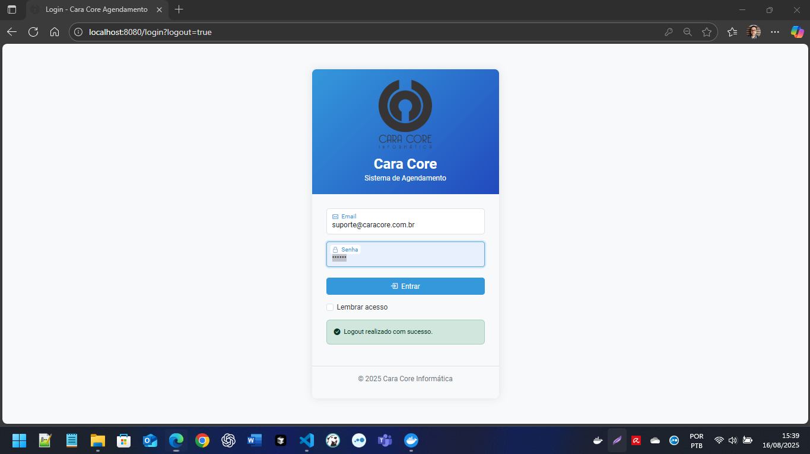
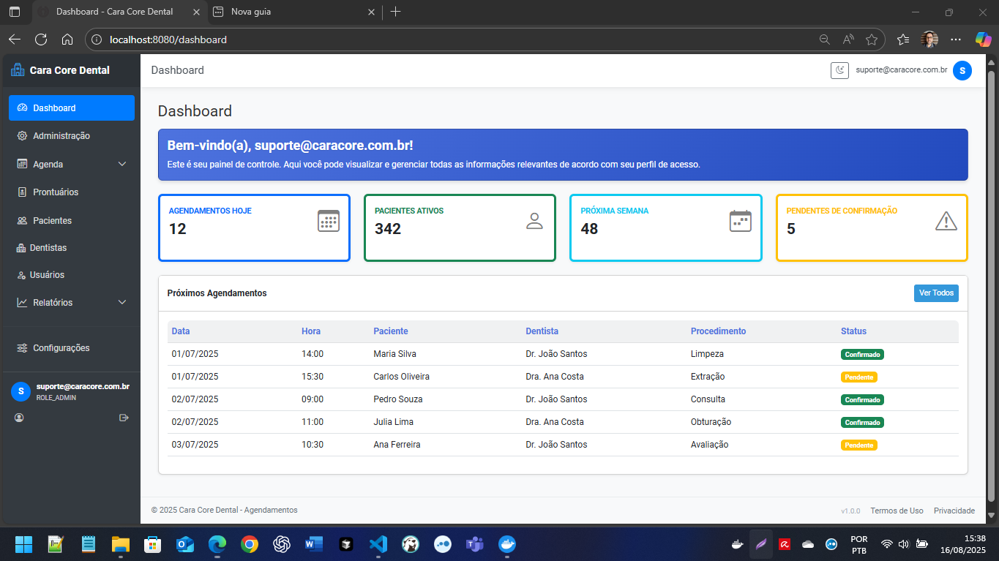

# Cara Core Dental - Agendamentos

> Sistema de agendamento para consultórios odontológicos desenvolvido com Spring Boot 3.2.6 e Java 17.

[](https://openjdk.java.net/projects/jdk/17/)
[](https://spring.io/projects/spring-boot)
[](https://www.postgresql.org/)
[](http://www.h2database.com/)
[](https://www.docker.com/)
[](#)

## Status do Projeto - MVP

**IMPORTANTE: Este é um produto mínimo viável (MVP)** que demonstra as funcionalidades principais do sistema de agendamento odontológico. 

### Melhorias de UX/UI Necessárias

**Layout e Design:**
- Refinamento da interface do usuário para maior profissionalismo
- Otimização da experiência mobile e tablet
- Melhoria na hierarquia visual e espaçamento entre elementos
- Padronização de cores e tipografia para identidade visual consistente

**Experiência do Usuário:**
- Simplificação de fluxos de navegação complexos
- Melhoria na usabilidade de formulários e validações
- Implementação de feedback visual mais intuitivo
- Otimização de performance e tempos de resposta

**Funcionalidades em Desenvolvimento:**
- Calendário visual avançado com drag-and-drop
- Sistema de notificações push em tempo real
- Dashboard analítico com relatórios visuais aprimorados
- Interface mobile nativa dedicada

Este MVP está **funcional e pronto para demonstrações**, mas requer investimento adicional em design e experiência do usuário para produção final.

<div align="center">
  
</div>

## Capturas de Tela

### Tela de Login
<div align="center">
  
  <p><em>Interface de autenticação com suporte a tema dark/light e validação em tempo real</em></p>
</div>

**Características da Tela de Login:**
- Suporte a tema dark/light com toggle automático
- Validação de credenciais em tempo real
- Opção "Lembrar-me" para sessões persistentes  
- Design responsivo para todos os dispositivos
- Feedback visual para erros de autenticação

### Dashboard Principal
<div align="center">
  
  <p><em>Dashboard completo com métricas, agenda e navegação intuitiva</em></p>
</div>

**Características do Dashboard:**
- Métricas em tempo real (consultas, pacientes, receitas)
- Agenda interativa com status de consultas coloridos
- Sidebar com navegação hierárquica e submenus dinâmicos
- Header fixo com alternador de tema e perfil do usuário
- Cards informativos com ícones Bootstrap
- Gráficos Chart.js para visualização de dados


## Início Rápido

### Executar o Sistema (Multi-Ambiente)

```powershell
# 1. Clonar o repositório
git clone https://github.com/chmulato/caracore-dental.git
cd caracore-dental

# 2. OPÇÃO 1: Desenvolvimento rápido com H2 (recomendado para testes)
$env:SPRING_PROFILES_ACTIVE='h2'
mvn spring-boot:run

# 3. OPÇÃO 2: Desenvolvimento com PostgreSQL (Docker)
# 3.1 - Subir PostgreSQL via Docker
docker run -d --name postgres-cca -e POSTGRES_DB=cca_db -e POSTGRES_USER=cca_user -e POSTGRES_PASSWORD=cca_pass -p 5432:5432 postgres:15

# 3.2 - Executar aplicação com PostgreSQL
$env:SPRING_PROFILES_ACTIVE='local'
mvn spring-boot:run

# 4. OPÇÃO 3: Scripts automáticos (Windows/Linux)
.\scr\start-environment.ps1    # Windows PowerShell
./scr/start-environment.sh     # Linux/macOS
.\scr\start-environment.bat    # Windows Batch

# 5. Acessar aplicação
# http://localhost:8080
```


### Credenciais de Acesso (Padronizadas)

As credenciais são agora **idênticas** em ambos os profiles para facilitar testes e desenvolvimento:

```
| Perfil           | Email                       | Senha    | Acesso                    |
|------------------|-----------------------------|----------|---------------------------|
| Administrador    | suporte@caracore.com.br     | admin123 | Acesso total ao sistema   |
| Dentista         | dentista@caracore.com.br    | admin123 | Agenda e prontuários      |
| Recepção         | recepcao@caracore.com.br    | admin123 | Agenda e pacientes        |
| Paciente         | joao@gmail.com              | admin123 | Área do paciente          |
```

**Usuários extras (ambos profiles):** ana.silva@caracore.com, carlos.oliveira@caracore.com, etc. - todos com senha `admin123`

> ✅ **Padronização completa:** As mesmas credenciais funcionam tanto no H2 (desenvolvimento rápido) quanto no PostgreSQL (local/produção).

## Funcionalidades Principais

### Sistema Totalmente Implementado

- **Autenticação e Segurança** - Spring Security 6 com controle de acesso
- **Dashboard Interativo** - Estatísticas e métricas em tempo real
- **Gestão de Consultas** - CRUD completo com reagendamento e controle de conflitos
- **Gestão de Pacientes** - Cadastro completo com integração WhatsApp
- **Gestão de Dentistas** - Especialidades, horários e controle CRO
- **Sistema de Prontuário** - Prontuários médicos com upload de imagens radiológicas
- **Multi-Ambiente** - Suporte H2 (desenvolvimento) e PostgreSQL (produção)
- **Navegação Completa** - Interface responsiva dual (autenticada/pública)
- **Sistema de Logs** - Auditoria completa de atividades de usuários
- **Conformidade LGPD** - Controle de consentimento e privacidade

### Interface e Experiência do Usuário

- **Tema Dark/Light** - Alternância automática com persistência de preferência
- **Design Responsivo** - Interface adaptável para desktop, tablet e mobile  
- **Bootstrap 5.3** - Design moderno com componentes interativos
- **Navegação Dinâmica** - Sidebar com submenus automáticos e breadcrumbs
- **Dashboard Interativo** - Métricas em tempo real com gráficos Chart.js
- **Busca e Filtros** - Tabelas DataTables com pesquisa avançada
- **Alertas Contextuais** - Feedback visual para ações do usuário
- **Login Seguro** - Interface de autenticação com validação em tempo real


### Arquitetura e Qualidade

- **545 Testes Unitários** - 100% de cobertura e aprovação
- **22 Migrações Flyway** - Controle de versão do banco de dados
- **Pool de Conexões** - HikariCP otimizado para cada ambiente
- **Padrão DTO** - Arquitetura robusta para performance
- **Docker Support** - PostgreSQL containerizado para desenvolvimento


### Próximas Funcionalidades

- Calendário visual avançado com FullCalendar.js
- Integração completa com WhatsApp Business API
- Relatórios avançados em PDF e Excel
- Sistema de notificações automáticas
- Interface mobile otimizada


## Tecnologias

**Backend:** Spring Boot 3.2.6, Spring Security 6, JPA/Hibernate, Flyway 9.22.3  
**Frontend:** Thymeleaf, Bootstrap 5.3.0, jQuery 3.7.0, Bootstrap Icons  
**Banco de Dados:** PostgreSQL 15 (produção), H2 (desenvolvimento/testes)  
**Build:** Maven 3.8+, Java 17 (OpenJDK)  
**Containerização:** Docker para PostgreSQL


## Pré-requisitos

- **Java 17+** (OpenJDK recomendado)
- **Maven 3.8+**
- **Docker** (opcional, para PostgreSQL via container)
- **PostgreSQL 15+** (opcional, usa H2 para desenvolvimento rápido)


## Configuração

### Profile H2 - Desenvolvimento Rápido (Padrão)

```powershell
# Executar com banco H2 em memória
$env:SPRING_PROFILES_ACTIVE='h2'
mvn spring-boot:run

# Console H2 disponível em:
# http://localhost:8080/h2-console
# JDBC URL: jdbc:h2:mem:devdb
# User: sa | Password: (vazio)
```

### Profile Local - PostgreSQL via Docker

```powershell
# Executar Tudo com Docker (Aplicação + PostgreSQL + pgAdmin)

Esta opção usa o `Dockerfile` multi-stage e `docker-compose.yml` + `docker-compose.override.yml`.

```powershell
# Build da imagem da aplicação
# 1. Subir PostgreSQL com Docker

# Subir stack completa (app, postgres, pgadmin)
docker run -d --name postgres-cca -e POSTGRES_DB=cca_db -e POSTGRES_USER=cca_user -e POSTGRES_PASSWORD=cca_pass -p 5432:5432 postgres:15

# Ver logs da aplicação


# Acessar aplicação (após logs mostrarem "Started")
# 2. Executar aplicação

# Acessar pgAdmin
$env:SPRING_PROFILES_ACTIVE='local'

# Registrar servidor no pgAdmin:
mvn spring-boot:run

# Rebuild após mudanças no código
```


## Subir Local com PostgreSQL (docker-compose)

```powershell
# 1. Subir stack (Postgres + App + pgAdmin)
docker compose up -d --build

# 2. Ver logs da aplicação
docker compose logs -f app

# 3. Acessar
# App:     http://localhost:8080
# pgAdmin: http://localhost:5050  (login: admin@local / admin123)
```

Credenciais (profile local - geradas pelo InitService):
- suporte@caracore.com.br / admin123 (ADMIN)
- dentista@caracore.com.br / admin123
- recepcao@caracore.com.br / admin123

Rebuild após mudanças de código:
```powershell
docker compose build app
docker compose up -d app
```

Parar e remover:
```powershell
docker compose down
```

Limpar volume de dados (perde tudo!):
```powershell
docker compose down -v
```

Alternativa: DB em container e app na máquina host
```powershell
# Start somente o Postgres
docker compose up -d postgres
# Rodar a aplicação localmente (usa profile local)
$env:SPRING_PROFILES_ACTIVE='local'
mvn spring-boot:run
```


# Parar e remover containers
### PostgreSQL Manual (Opcional)

# Limpar volumes (perde dados!)

```

Variáveis principais (podem ser sobrescritas):
```
| Variável               | Padrão            | Descrição               |
|------------------------|-------------------|-------------------------|
| SPRING_PROFILES_ACTIVE | local             | Usa PostgreSQL e Flyway |
| SERVER_PORT            | 8080              | Porta HTTP da aplicação |
| JAVA_OPTS              | -Xms256m -Xmx512m | Ajustes de memória JVM  |
```

Healthcheck do container utiliza `GET /actuator/health`.

```sql
-- Criar banco PostgreSQL
CREATE DATABASE cca_db;
CREATE USER cca_user WITH PASSWORD 'cca_pass';
GRANT ALL PRIVILEGES ON DATABASE cca_db TO cca_user;
```


## Testes

```powershell
# Executar todos os testes (545 testes - 100% aprovação)
mvn test

# Relatório de cobertura
mvn clean test jacoco:report

# Testes específicos por módulo
mvn test -Dtest=ConsultasControllerTest
mvn test -Dtest=ProntuarioControllerTest

# Validar setup multi-ambiente
mvn test -Dspring.profiles.active=h2
mvn test -Dspring.profiles.active=local
```


## Status Técnico do Projeto

### MVP Funcional - Base Sólida Implementada

**Funcionalidades Core Completadas:**
- **Multi-Ambiente:** Suporte completo para H2 e PostgreSQL com Docker
- **Navegação:** Interface completa e responsiva com sistema dual
- **Banco de Dados:** PostgreSQL integrado com 22 migrações Flyway
- **Testes:** 545 testes unitários com 100% de aprovação
- **Segurança:** Autenticação, autorização e compliance LGPD funcionando
- **Prontuários:** Sistema completo com upload de imagens radiológicas
- **Logs:** Sistema de auditoria implementado
- **Performance:** Pool de conexões HikariCP otimizado

**Status Técnico:** VERDE - Base sólida e estável para desenvolvimento futuro

**Próxima Fase:** Investimento em UX/UI Design e otimização da experiência do usuário

Ver [STATUS_ATUAL.md](STATUS_ATUAL.md) para relatório detalhado e [doc/INDEX.md](doc/INDEX.md) para documentação completa.


## Licença

Este projeto está licenciado sob a [MIT License](LICENSE).


## Equipe

**Cara Core Informática**  
Sistema de Agendamento para Consultórios Odontológicos

---

**Última atualização:** 24/07/2025 - Sistema multi-ambiente implementado e pronto para homologação!
