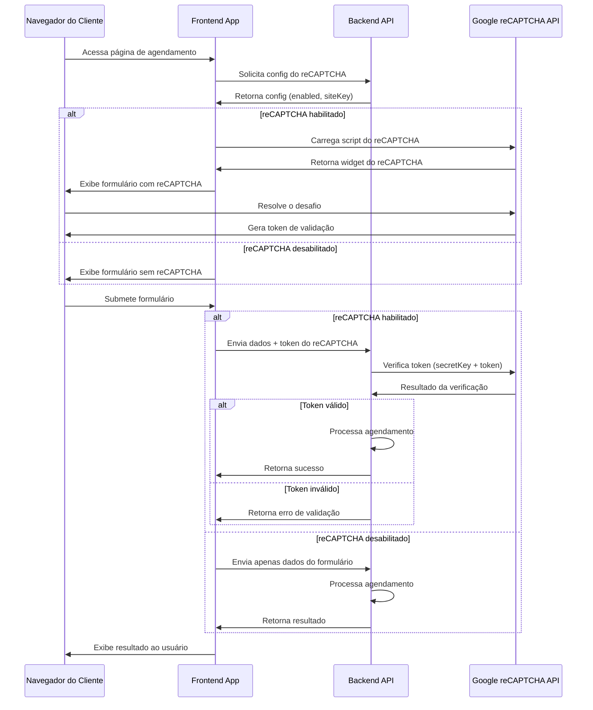
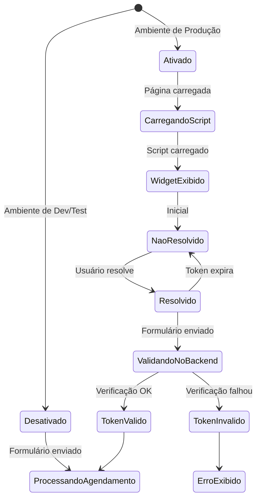
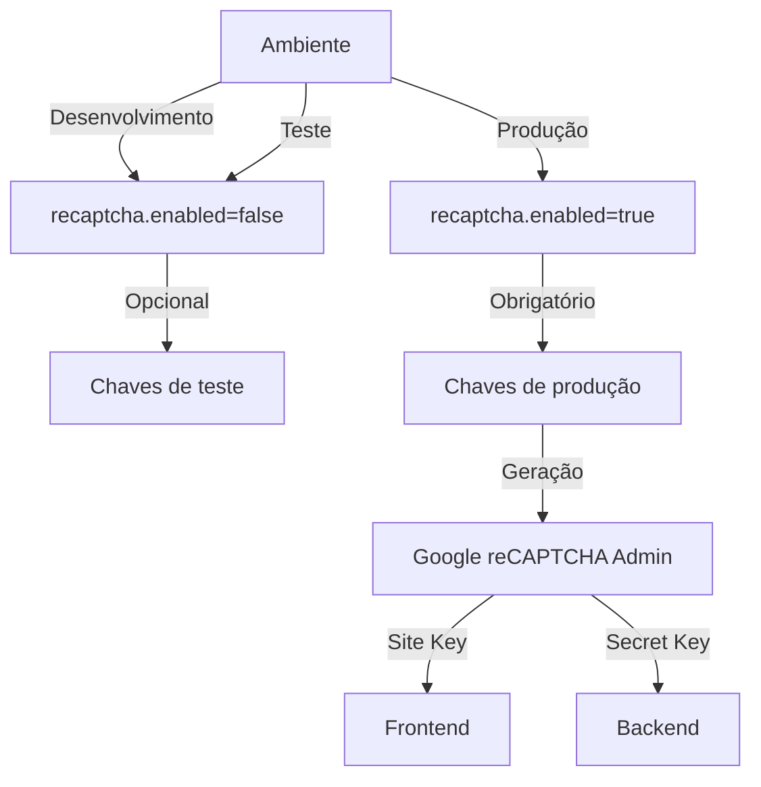

# Fluxo de Funcionamento do reCAPTCHA

Este documento apresenta os diagramas de fluxo para entendimento da implementação do reCAPTCHA no sistema de agendamento online.

## Diagrama de Sequência

## Diagrama de Estados do reCAPTCHA

## Configuração e Chaves

