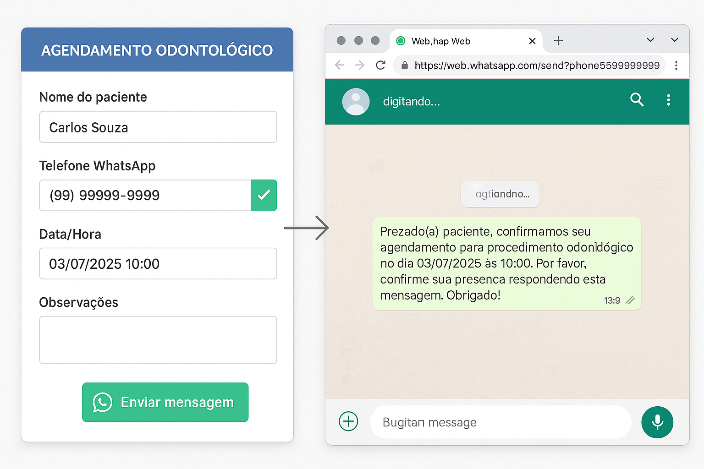

# Wiki do Projeto Cara Core Agendamento (CCA)

Bem-vindo à wiki do projeto Cara Core Agendamento! Este espaço contém a documentação completa do sistema, desde a instalação até os detalhes técnicos de cada funcionalidade.

## Índice

- [Wiki do Projeto Cara Core Agendamento (CCA)](#wiki-do-projeto-cara-core-agendamento-cca)
  - [Índice](#índice)
  - [Visão Geral do Sistema](#visão-geral-do-sistema)
    - [Tecnologias Utilizadas](#tecnologias-utilizadas)
    - [Arquitetura](#arquitetura)
  - [Instalação e Configuração](#instalação-e-configuração)
    - [Pré-requisitos](#pré-requisitos)
    - [Passos para Instalação](#passos-para-instalação)
  - [Funcionalidades Principais](#funcionalidades-principais)
    - [Gestão de Dentistas](#gestão-de-dentistas)
      - [Funcionalidades Principais](#funcionalidades-principais-1)
      - [Cadastro e Edição](#cadastro-e-edição)
      - [Busca e Filtros](#busca-e-filtros)
      - [Controle de Status](#controle-de-status)
    - [Gestão de Pacientes](#gestão-de-pacientes)
      - [Dados Armazenados](#dados-armazenados)
      - [Portaria nº 2.836/2011 - Ministério da Saúde](#portaria-nº-28362011---ministério-da-saúde)
      - [Sistema de Consentimento LGPD](#sistema-de-consentimento-lgpd)
  - [Índice](#índice-1)
  - [Visão Geral do Sistema](#visão-geral-do-sistema-1)
    - [Tecnologias Utilizadas](#tecnologias-utilizadas-1)
    - [Arquitetura](#arquitetura-1)
  - [Instalação e Configuração](#instalação-e-configuração-1)
    - [Pré-requisitos](#pré-requisitos-1)
    - [Passos para Instalação](#passos-para-instalação-1)
    - [Configuração para Produção](#configuração-para-produção)
  - [Funcionalidades Principais](#funcionalidades-principais-2)
    - [Agendamento de Consultas](#agendamento-de-consultas)
      - [Sistema de Consultas Implementado](#sistema-de-consultas-implementado)
      - [Controle de Acesso por Perfil](#controle-de-acesso-por-perfil)
      - [Fluxo de Agendamento](#fluxo-de-agendamento)
      - [Validações Implementadas](#validações-implementadas)
    - [Gestão de Pacientes](#gestão-de-pacientes-1)
      - [Dados Armazenados](#dados-armazenados-1)
    - [Integração com WhatsApp](#integração-com-whatsapp)
      - [Funcionalidades Implementadas](#funcionalidades-implementadas)
      - [Benefícios](#benefícios)
      - [Como utilizar](#como-utilizar)
      - [Código de Exemplo](#código-de-exemplo)
  - [Endpoints Públicos de Agendamento](#endpoints-públicos-de-agendamento)
    - [Visão Geral](#visão-geral)
    - [Endpoints Implementados](#endpoints-implementados)
      - [1. **POST /public/agendar** - Agendamento Online](#1-post-publicagendar---agendamento-online)
      - [2. **GET /public/api/dentistas** - Lista de Dentistas](#2-get-publicapidentistas---lista-de-dentistas)
      - [3. **GET /public/api/horarios-disponiveis** - Horários Disponíveis](#3-get-publicapihorarios-disponiveis---horários-disponíveis)
      - [4. **GET /public/test-simple** - Teste de Conectividade](#4-get-publictest-simple---teste-de-conectividade)
    - [Estratégias de Segurança](#estratégias-de-segurança)
      - [**Rate Limiting**](#rate-limiting)
      - [**Proteção reCAPTCHA**](#proteção-recaptcha)
      - [**Validação e Sanitização**](#validação-e-sanitização)
      - [**Logs e Auditoria**](#logs-e-auditoria)
      - [**Headers de Segurança**](#headers-de-segurança)
    - [Exemplos de Uso](#exemplos-de-uso)
      - [Exemplo JavaScript (Frontend)](#exemplo-javascript-frontend)
      - [Exemplo cURL (Testes)](#exemplo-curl-testes)
    - [Validação e Sanitização](#validação-e-sanitização-1)
      - [Validações Implementadas](#validações-implementadas-1)
      - [Tratamento de Erros](#tratamento-de-erros)
  - [Compliance Legal e Regulamentações](#compliance-legal-e-regulamentações)
    - [Flyway Migrations](#flyway-migrations)
      - [Exemplo de Structure:](#exemplo-de-structure)
    - [Scripts Consolidados](#scripts-consolidados)
    - [Boas Práticas](#boas-práticas)
      - [Comandos Úteis:](#comandos-úteis)
  - [Testes e Qualidade](#testes-e-qualidade)
    - [Estrutura de Testes](#estrutura-de-testes)
    - [Testes Unitários de Agendamentos](#testes-unitários-de-agendamentos)
      - [**AgendamentoServiceTest (19 testes)**](#agendamentoservicetest-19-testes)
      - [**ConsultasControllerTest (18 testes)**](#consultascontrollertest-18-testes)
    - [Configuração de Mocks](#configuração-de-mocks)
      - [Tipos de Teste Implementados:](#tipos-de-teste-implementados)
      - [Execução de Testes:](#execução-de-testes)
    - [Testes de Endpoints Públicos](#testes-de-endpoints-públicos)
      - [**AgendamentoPublicoControllerTest**](#agendamentopublicocontrollertest)
      - [Exemplo de Teste Completo:](#exemplo-de-teste-completo)
      - [Cobertura de Código:](#cobertura-de-código)
  - [FAQ e Solução de Problemas](#faq-e-solução-de-problemas)
    - [Perguntas Frequentes](#perguntas-frequentes)
    - [Problemas Comuns](#problemas-comuns)
  - [Contribuindo com o Projeto](#contribuindo-com-o-projeto)
    - [Como Contribuir](#como-contribuir)
    - [Padrões de Código](#padrões-de-código)
    - [Próximos Passos](#próximos-passos)
      - [Funcionalidades Implementadas Recentemente (Julho 2025)](#funcionalidades-implementadas-recentemente-julho-2025)
      - [Próximas Funcionalidades Planejadas (Q4 2025)](#próximas-funcionalidades-planejadas-q4-2025)

---

## Visão Geral do Sistema

O Cara Core Agendamento (CCA) é uma solução completa para gestão de agendamentos em consultórios odontológicos. O sistema foi desenvolvido com foco na usabilidade, eficiência, comunicação com o paciente e **total conformidade com a legislação brasileira** (LGPD e Portaria nº 2.836/2011 do Ministério da Saúde).

### Tecnologias Utilizadas

- **Backend:** Java 17 + Spring Boot 3.2.6
- **Frontend:** Thymeleaf + Bootstrap 5.3.0
- **Banco de Dados:** PostgreSQL 15+
- **Segurança:** Spring Security + BCrypt
- **DevOps:** Docker + Maven
- **Compliance:** LGPD + Portaria MS 2.836/2011

### Arquitetura

O sistema segue o padrão MVC (Model-View-Controller) com a seguinte estrutura:

```markdown
src/main/
├── java/com/caracore/cca/
│   ├── config/             # Configurações Spring
│   ├── controller/         # Controllers MVC e REST
│   ├── dto/                # Data Transfer Objects
│   ├── model/              # Entidades JPA
│   ├── repository/         # Repositories
│   ├── service/            # Lógica de negócio
│   └── util/               # Utilitários
├── resources/
│   ├── templates/          # Templates Thymeleaf
│   ├── static/             # Recursos estáticos
│   └── application.yml     # Configurações da aplicação
```

---

## Instalação e Configuração

### Pré-requisitos

- Java 17+
- Docker e Docker Compose
- PostgreSQL 15+ (ou use o container Docker)
- Maven 3.8+

### Passos para Instalação

1. Clone o repositório:

```bash
git clone https://github.com/chmulato/cara-core_cca.git
```

---

## Funcionalidades Principais

### Gestão de Dentistas

O módulo de gestão de dentistas oferece controle completo sobre os profissionais do consultório, seguindo o padrão visual Bootstrap 5.3.0 e práticas modernas de UX/UI.

#### Funcionalidades Principais

- **Cadastro Completo**: Nome, email, telefone, CRO, especialidades
- **Controle de Status**: Ativo/Inativo com indicadores visuais claros
- **Horários de Atendimento**: Configuração de disponibilidade semanal
- **Busca Avançada**: Filtros por nome, especialidade, email e status
- **Interface Responsiva**: Otimizada para desktop, tablet e mobile

#### Cadastro e Edição

O formulário de dentistas inclui:

- **Dados Pessoais**: Nome completo, email, telefone
- **Dados Profissionais**: Número do CRO, especialidades principais
- **Configurações**: Status (ativo/inativo), observações
- **Validações**: Email único, formato de telefone, campos obrigatórios

```html
<!-- Exemplo de card de dentista -->
<div class="card dentista-card">
    <div class="card-body">
        <div class="d-flex align-items-center mb-3">
            
            <div>
                <h5 class="card-title mb-0">Dr. João Silva</h5>
                <span class="badge bg-success">Ativo</span>
            </div>
        </div>
        <p class="card-text">
            <i class="bi bi-envelope me-2"></i>joao@clinica.com<br>
            <i class="bi bi-telephone me-2"></i>(11) 99999-9999<br>
            <i class="bi bi-award me-2"></i>Ortodontia, Implantes
        </p>
    </div>
</div>
```

#### Busca e Filtros

Sistema de busca em tempo real com:

- **Busca Global**: Pesquisa em nome, email e especialidades
- **Filtro por Status**: Ativo, Inativo ou Todos
- **Ordenação**: Por nome, data de cadastro, status
- **Paginação**: Navegação eficiente para grandes volumes

#### Controle de Status

- **Indicadores Visuais**: Badges coloridos (verde=ativo, vermelho=inativo)
- **Toggle Rápido**: Ativação/desativação direta da listagem
- **Histórico**: Rastreamento de alterações de status
- **Validações**: Não permitir desativar dentista com agendamentos futuros

### Gestão de Pacientes

O módulo de pacientes oferece cadastro completo com dados pessoais, histórico de consultas, prontuário digital integrado e controle total de consentimento LGPD, além do atendimento à **Portaria nº 2.836/2011 do Ministério da Saúde** para nome social e identidade de gênero.

#### Dados Armazenados

- **Dados Pessoais**: Nome completo (civil), email, telefone WhatsApp (obrigatório)
- **Nome Social**: Conforme Portaria nº 2.836/2011 do Ministério da Saúde
- **Gênero**: Autodeclaração com opções padronizadas (Feminino, Masculino, Não-binário, Outro, Prefere não informar)
- **Endereço**: CEP, logradouro, cidade, estado
- **Histórico Médico**: Alergias, medicamentos, condições especiais
- **Histórico de Agendamentos**: Consultas realizadas e agendadas
- **Prontuário Digital**: Upload e organização de documentos
- **Consentimento LGPD**: Status, confirmação e data de envio
- **Observações**: Notas importantes sobre o paciente

#### Portaria nº 2.836/2011 - Ministério da Saúde

O sistema implementa integralmente os direitos garantidos pela Portaria nº 2.836/2011 do Ministério da Saúde, que institui a **Política Nacional de Saúde Integral de Lésbicas, Gays, Bissexuais, Travestis e Transexuais (LGBT)** no âmbito do Sistema Único de Saúde (SUS).

**Implementação Técnica:**

- **Nome Social**: Campo opcional separado do nome civil
  - Exibido com destaque visual (ícone específico)
  - Usado preferencialmente em interfaces do sistema
  - Respeitado em todas as comunicações com o paciente

- **Gênero**: Autodeclaração com 5 opções padronizadas:
  - **Feminino**
  - **Masculino** 
  - **Não-binário**
  - **Outro**
  - **Prefere não informar**

**Interface do Usuário:**

```html
<!-- Nome Social -->
<div class="mb-3">
    <label for="nomeSocial" class="form-label">
        <i class="bi bi-person-heart text-info me-1"></i>
        Nome Social
    </label>
    <input type="text" class="form-control" id="nomeSocial" name="nomeSocial" maxlength="100">
    <div class="form-text">
        <small class="text-muted">
            <i class="bi bi-info-circle me-1"></i>
            Nome pelo qual a pessoa se identifica socialmente. 
            <strong>Portaria nº 2.836/2011 - Ministério da Saúde</strong>
        </small>
    </div>
</div>

<!-- Gênero -->
<div class="mb-3">
    <label for="genero" class="form-label">
        <i class="bi bi-gender-ambiguous text-info me-1"></i>
        Gênero (Autodeclaração)
    </label>
    <select class="form-select" id="genero" name="genero">
        <option value="">Selecione o gênero</option>
        <option value="FEMININO">Feminino</option>
        <option value="MASCULINO">Masculino</option>
        <option value="NAO_BINARIO">Não-binário</option>
        <option value="OUTRO">Outro</option>
        <option value="PREFERE_NAO_INFORMAR">Prefere não informar</option>
    </select>
</div>
```

**Seção Informativa:**
O formulário inclui uma seção educativa sobre a legislação:

```html
<div class="alert alert-info" role="alert">
    <h6 class="alert-heading">
        <i class="bi bi-info-circle me-2"></i>
        Portaria nº 2.836/2011 - Ministério da Saúde
    </h6>
    <p class="mb-2">
        <strong>Nome Social:</strong> É o nome pelo qual a pessoa se identifica e é socialmente 
        reconhecida, independentemente do nome civil constante no registro civil.
    </p>
    <small class="text-muted">
        Este direito está garantido pela legislação brasileira e deve ser respeitado em todas 
        as situações de atendimento no Sistema Único de Saúde (SUS).
    </small>
</div>
```

**Exibição na Lista de Pacientes:**

```html
<td>
    <div>
        <strong>João Silva Santos</strong> <!-- Nome Civil -->
        <div class="text-muted small">
            <i class="bi bi-person-heart text-info me-1"></i>
            <em>João Silva</em> <!-- Nome Social -->
        </div>
        <div class="mt-1">
            <span class="badge bg-light text-dark small">MASCULINO</span>
        </div>
    </div>
</td>
```

#### Sistema de Consentimento LGPD

O sistema implementa um controle rigoroso de consentimento LGPD conforme exigido pela Lei Geral de Proteção de Dados:

**Funcionalidades:**

- **Envio via WhatsApp**: Mensagem padrão de consentimento enviada automaticamente
- **Controle de Status**: Rastreamento de envio e confirmação
- **Data/Hora**: Registro temporal de todos os eventos
- **Validação**: Impedimento de processamento sem consentimento adequado

**Fluxo do Processo:**

1. **Cadastro**: WhatsApp obrigatório no formulário do paciente
2. **Envio**: Clique no botão "Enviar Consentimento LGPD" 
3. **WhatsApp**: Abre mensagem padrão com termos LGPD
4. **Confirmação**: Marcar quando paciente responder "ACEITO"
5. **Compliance**: Sistema bloqueia ações sem consentimento

**Mensagem Padrão LGPD:**

```markdown
Olá [Nome]!

Este é o consultório Cara Core Agendamento.

Conforme a Lei Geral de Proteção de Dados (LGPD), solicitamos seu consentimento para:

Armazenar seus dados pessoais (nome, telefone, email)
Utilizar seus dados para agendamentos e comunicações  
Enviar lembretes de consultas via WhatsApp

Seus dados são protegidos e utilizados apenas para fins médicos e administrativos.

Por favor, responda "ACEITO" para confirmar seu consentimento.

Obrigado!
```

de a instalação até os detalhes técnicos de cada funcionalidade.

## Índice

- [Wiki do Projeto Cara Core Agendamento (CCA)](#wiki-do-projeto-cara-core-agendamento-cca)
  - [Índice](#índice)
  - [Visão Geral do Sistema](#visão-geral-do-sistema)
    - [Tecnologias Utilizadas](#tecnologias-utilizadas)
    - [Arquitetura](#arquitetura)
  - [Instalação e Configuração](#instalação-e-configuração)
    - [Pré-requisitos](#pré-requisitos)
    - [Passos para Instalação](#passos-para-instalação)
  - [Funcionalidades Principais](#funcionalidades-principais)
    - [Gestão de Dentistas](#gestão-de-dentistas)
      - [Funcionalidades Principais](#funcionalidades-principais-1)
      - [Cadastro e Edição](#cadastro-e-edição)
      - [Busca e Filtros](#busca-e-filtros)
      - [Controle de Status](#controle-de-status)
    - [Gestão de Pacientes](#gestão-de-pacientes)
      - [Dados Armazenados](#dados-armazenados)
      - [Portaria nº 2.836/2011 - Ministério da Saúde](#portaria-nº-28362011---ministério-da-saúde)
      - [Sistema de Consentimento LGPD](#sistema-de-consentimento-lgpd)
  - [Índice](#índice-1)
  - [Visão Geral do Sistema](#visão-geral-do-sistema-1)
    - [Tecnologias Utilizadas](#tecnologias-utilizadas-1)
    - [Arquitetura](#arquitetura-1)
  - [Instalação e Configuração](#instalação-e-configuração-1)
    - [Pré-requisitos](#pré-requisitos-1)
    - [Passos para Instalação](#passos-para-instalação-1)
    - [Configuração para Produção](#configuração-para-produção)
  - [Funcionalidades Principais](#funcionalidades-principais-2)
    - [Agendamento de Consultas](#agendamento-de-consultas)
      - [Sistema de Consultas Implementado](#sistema-de-consultas-implementado)
      - [Controle de Acesso por Perfil](#controle-de-acesso-por-perfil)
      - [Fluxo de Agendamento](#fluxo-de-agendamento)
      - [Validações Implementadas](#validações-implementadas)
    - [Gestão de Pacientes](#gestão-de-pacientes-1)
      - [Dados Armazenados](#dados-armazenados-1)
    - [Integração com WhatsApp](#integração-com-whatsapp)
      - [Funcionalidades Implementadas](#funcionalidades-implementadas)
      - [Benefícios](#benefícios)
      - [Como utilizar](#como-utilizar)
      - [Código de Exemplo](#código-de-exemplo)
  - [Endpoints Públicos de Agendamento](#endpoints-públicos-de-agendamento)
    - [Visão Geral](#visão-geral)
    - [Endpoints Implementados](#endpoints-implementados)
      - [1. **POST /public/agendar** - Agendamento Online](#1-post-publicagendar---agendamento-online)
      - [2. **GET /public/api/dentistas** - Lista de Dentistas](#2-get-publicapidentistas---lista-de-dentistas)
      - [3. **GET /public/api/horarios-disponiveis** - Horários Disponíveis](#3-get-publicapihorarios-disponiveis---horários-disponíveis)
      - [4. **GET /public/test-simple** - Teste de Conectividade](#4-get-publictest-simple---teste-de-conectividade)
    - [Estratégias de Segurança](#estratégias-de-segurança)
      - [**Rate Limiting**](#rate-limiting)
      - [**Proteção reCAPTCHA**](#proteção-recaptcha)
      - [**Validação e Sanitização**](#validação-e-sanitização)
      - [**Logs e Auditoria**](#logs-e-auditoria)
      - [**Headers de Segurança**](#headers-de-segurança)
    - [Exemplos de Uso](#exemplos-de-uso)
      - [Exemplo JavaScript (Frontend)](#exemplo-javascript-frontend)
      - [Exemplo cURL (Testes)](#exemplo-curl-testes)
    - [Validação e Sanitização](#validação-e-sanitização-1)
      - [Validações Implementadas](#validações-implementadas-1)
      - [Tratamento de Erros](#tratamento-de-erros)
  - [Compliance Legal e Regulamentações](#compliance-legal-e-regulamentações)
    - [Flyway Migrations](#flyway-migrations)
      - [Exemplo de Structure:](#exemplo-de-structure)
    - [Scripts Consolidados](#scripts-consolidados)
    - [Boas Práticas](#boas-práticas)
      - [Comandos Úteis:](#comandos-úteis)
  - [Testes e Qualidade](#testes-e-qualidade)
    - [Estrutura de Testes](#estrutura-de-testes)
    - [Testes Unitários de Agendamentos](#testes-unitários-de-agendamentos)
      - [**AgendamentoServiceTest (19 testes)**](#agendamentoservicetest-19-testes)
      - [**ConsultasControllerTest (18 testes)**](#consultascontrollertest-18-testes)
    - [Configuração de Mocks](#configuração-de-mocks)
      - [Tipos de Teste Implementados:](#tipos-de-teste-implementados)
      - [Execução de Testes:](#execução-de-testes)
    - [Testes de Endpoints Públicos](#testes-de-endpoints-públicos)
      - [**AgendamentoPublicoControllerTest**](#agendamentopublicocontrollertest)
      - [Exemplo de Teste Completo:](#exemplo-de-teste-completo)
      - [Cobertura de Código:](#cobertura-de-código)
  - [FAQ e Solução de Problemas](#faq-e-solução-de-problemas)
    - [Perguntas Frequentes](#perguntas-frequentes)
    - [Problemas Comuns](#problemas-comuns)
  - [Contribuindo com o Projeto](#contribuindo-com-o-projeto)
    - [Como Contribuir](#como-contribuir)
    - [Padrões de Código](#padrões-de-código)
    - [Próximos Passos](#próximos-passos)
      - [Funcionalidades Implementadas Recentemente (Julho 2025)](#funcionalidades-implementadas-recentemente-julho-2025)
      - [Próximas Funcionalidades Planejadas (Q4 2025)](#próximas-funcionalidades-planejadas-q4-2025)

---

## Visão Geral do Sistema

O Cara Core Agendamento (CCA) é uma solução completa para gestão de agendamentos em consultórios odontológicos. O sistema foi desenvolvido com foco na usabilidade, eficiência e comunicação com o paciente.

### Tecnologias Utilizadas

- **Backend:** Java 17 + Spring Boot 3.2.6
- **Frontend:** Thymeleaf + Bootstrap 5.3.0
- **Banco de Dados:** PostgreSQL 15+
- **Segurança:** Spring Security + BCrypt
- **DevOps:** Docker + Maven

### Arquitetura

O sistema segue o padrão MVC (Model-View-Controller) com a seguinte estrutura:

```markdown
src/main/
├── java/com/caracore/cca/
│   ├── config/             # Configurações Spring
│   ├── controller/         # Controllers MVC e REST
│   ├── dto/                # Data Transfer Objects
│   ├── model/              # Entidades JPA
│   ├── repository/         # Repositories
│   ├── service/            # Lógica de negócio
│   └── util/               # Utilitários
├── resources/
│   ├── templates/          # Templates Thymeleaf
│   ├── static/             # Recursos estáticos
│   └── application.yml     # Configurações da aplicação
```

---

## Instalação e Configuração

### Pré-requisitos

- Java 17+
- Docker e Docker Compose
- PostgreSQL 15+ (ou use o container Docker)
- Maven 3.8+

### Passos para Instalação

1. Clone o repositório:

```bash
git clone https://github.com/chmulato/cara-core_cca.git
cd cara-core_cca
```

2. Inicie o banco de dados:

```bash
docker-compose up -d
```

3. Compile e execute a aplicação:

```bash
mvn clean spring-boot:run
```

4. Acesse o sistema em: [http://localhost:8080](http://localhost:8080)

### Configuração para Produção

Para ambientes de produção, configure as seguintes variáveis de ambiente:

- `DB_HOST` - Host do PostgreSQL
- `DB_PORT` - Porta do PostgreSQL
- `DB_NAME` - Nome do banco de dados
- `DB_USERNAME` - Usuário do banco
- `DB_PASSWORD` - Senha do banco
- `SERVER_PORT` - Porta da aplicação (padrão: 8080)
- `SPRING_PROFILES_ACTIVE` - Profile ativo (dev, prod, test)

---

## Funcionalidades Principais

### Agendamento de Consultas

O sistema oferece uma gestão completa de agendamentos com funcionalidades avançadas para controle de consultas, reagendamentos e acompanhamento do status.

#### Sistema de Consultas Implementado

**CRUD Completo:**

- **Criação** de novos agendamentos com validações
- **Visualização** com filtros por status, data e dentista
- **Edição** e reagendamento com histórico
- **Exclusão** controlada por perfil de acesso

**Controle de Status:**

- **Agendado** - Consulta marcada
- **Confirmado** - Paciente confirmou presença
- **Realizado** - Consulta foi realizada
- **Cancelado** - Consulta cancelada com motivo

**Funcionalidades Avançadas:**

- **Detecção de Conflitos:** Verificação automática de horários ocupados
- **Reagendamento:** Alteração de data/hora com notificação automática
- **Dashboard:** Visão geral com métricas e filtros
- **Histórico:** Registro completo de alterações

#### Controle de Acesso por Perfil

**ADMIN (Administrador):**

- Acesso completo: visualizar, criar, editar, cancelar, excluir
- Dashboard com métricas completas
- Relatórios e estatísticas

**RECEPTIONIST (Recepcionista):**

- Visualizar, criar, editar e cancelar agendamentos
- Reagendar consultas
- Confirmar presença de pacientes
- Não pode excluir registros

**DENTIST (Dentista):**

- Visualizar agendamentos próprios
- Marcar consultas como realizadas
- Dashboard de suas consultas
- Não pode criar novos agendamentos

#### Fluxo de Agendamento

1. Acessar o formulário de novo agendamento
2. Selecionar paciente ou cadastrar novo
3. Confirmar/atualizar o telefone WhatsApp do paciente (obrigatório)
4. Selecionar dentista, data e hora
5. Definir duração e observações
6. Confirmar agendamento

#### Validações Implementadas

- Verificação de disponibilidade de horário
- Detecção de conflitos com outros agendamentos
- Validação de dados obrigatórios
- Controle de acesso por perfil
- Formato correto de telefone WhatsApp

### Gestão de Pacientes

O módulo de pacientes permite o cadastro completo com dados pessoais, histórico de consultas e prontuário digital.

#### Dados Armazenados

- Nome completo
- E-mail
- Telefone WhatsApp (validado e formatado)
- Histórico de agendamentos
- Observações e condições especiais

### Integração com WhatsApp

Uma das principais funcionalidades do sistema é a integração direta com WhatsApp para comunicação eficiente com pacientes.

#### Funcionalidades Implementadas

- **Campo obrigatório de WhatsApp**: Telefone validado e formatado automaticamente
- **Atualização do cadastro**: Telefone atualizado automaticamente no cadastro do paciente
- **Integração com WhatsApp Web**: Botão que abre conversa diretamente pelo navegador
- **Formatação automática**: Conversão para o formato internacional compatível com a API do WhatsApp

#### Benefícios

- **Redução de faltas**: Lembretes eficientes reduzem o número de consultas perdidas
- **Comunicação rápida**: Envio de instruções pré e pós-procedimento
- **Melhor experiência**: Pacientes apreciam a facilidade de comunicação
- **Confirmações eficientes**: Confirmação de horários com antecedência

#### Como utilizar

1. Durante o agendamento, preencha ou confirme o telefone WhatsApp do paciente
2. Clique no ícone verde do WhatsApp ao lado do campo telefone
3. O navegador abrirá uma nova aba com o WhatsApp Web e a conversa iniciada
4. Envie a mensagem desejada ao paciente



#### Código de Exemplo

```javascript
// Função para gerar link do WhatsApp
function gerarLinkWhatsApp(telefone) {
    // Remove caracteres não numéricos
    const numeroLimpo = telefone.replace(/\D/g, '');
    
    // Verifica se o número tem pelo menos 10 dígitos (DDD + número)
    if (numeroLimpo.length >= 10) {
        // Formata o número para o WhatsApp (com código do Brasil +55)
        return `https://wa.me/55${numeroLimpo}`;
    }
    return '#';
}
```

---

## Endpoints Públicos de Agendamento

O sistema possui uma API pública segura para permitir agendamentos online diretamente por pacientes ou sistemas externos, mantendo total compatibilidade com as práticas de segurança modernas.

### Visão Geral

Os endpoints públicos foram desenvolvidos seguindo os princípios de **Security by Design**, implementando múltiplas camadas de proteção contra ataques comuns como CSRF, XSS, SQL Injection, e ataques de força bruta.

**Funcionalidades Implementadas:**

- **Rate Limiting**: Proteção contra ataques de força bruta
- **Validação Rigorosa**: Sanitização de entrada em todos os campos
- **Logs Detalhados**: Auditoria completa de todas as requisições
- **Headers de Segurança**: Proteção contra XSS e outros ataques
- **Monitoramento**: Métricas de uso e detecção de anomalias
- ⚡ **Performance**: Respostas otimizadas com cache adequado

### Endpoints Implementados

#### 1. **POST /public/agendar** - Agendamento Online

Endpoint principal para criação de agendamentos por pacientes:

```http
POST /public/agendar
Content-Type: application/json

{
  "nomeCompleto": "João Silva Santos",
  "telefone": "(11) 99999-9999",
  "email": "joao@exemplo.com",
  "dentistaId": 1,
  "dataAgendamento": "2025-07-15",
  "horaAgendamento": "14:30",
  "observacoes": "Primeira consulta"
}
```

**Resposta de Sucesso:**

```json
{
  "success": true,
  "message": "Agendamento realizado com sucesso!",
  "agendamentoId": 123,
  "dataAgendamento": "2025-07-15",
  "horaAgendamento": "14:30",
  "dentista": "Dr. Maria Santos"
}
```

#### 2. **GET /public/api/dentistas** - Lista de Dentistas

Retorna dentistas disponíveis para agendamento:

```http
GET /public/api/dentistas
```

**Resposta:**

```json
{
  "success": true,
  "dentistas": [
    {
      "id": 1,
      "nome": "Dr. Maria Santos",
      "especialidades": ["Clínico Geral", "Ortodontia"],
      "disponivel": true
    },
    {
      "id": 2,
      "nome": "Dr. João Silva",
      "especialidades": ["Implantodontia", "Cirurgia"],
      "disponivel": true
    }
  ]
}
```

#### 3. **GET /public/api/horarios-disponiveis** - Horários Disponíveis

Consulta horários livres para agendamento:

```http
GET /public/api/horarios-disponiveis?dentistaId=1&data=2025-07-15
```

**Resposta:**

```json
{
  "success": true,
  "data": "2025-07-15",
  "dentista": "Dr. Maria Santos",
  "horariosDisponiveis": [
    "08:00", "08:30", "09:00", "14:00", "14:30", "15:00"
  ]
}
```

#### 4. **GET /public/test-simple** - Teste de Conectividade

Endpoint de teste para verificar disponibilidade da API:

```http
GET /public/test-simple
```

**Resposta:**

```json
{
  "status": "online",
  "timestamp": "2025-07-05T10:30:00Z",
  "version": "1.0.0"
}
```

### Estratégias de Segurança

#### **Rate Limiting**
Implementado controle de taxa de requisições para prevenir ataques:

```java
@RateLimiter(name = "agendamento-publico", fallbackMethod = "handleRateLimit")
public ResponseEntity<?> agendarConsulta(@RequestBody AgendamentoRequest request) {
    // Lógica de agendamento
}

private ResponseEntity<?> handleRateLimit(AgendamentoRequest request, Exception ex) {
    return ResponseEntity.status(429)
        .body(Map.of("error", "Muitas tentativas. Tente novamente em alguns minutos."));
}
```

**Configuração:**

- **Limite**: 10 requisições por minuto por IP
- **Janela**: 60 segundos
- **Fallback**: Resposta HTTP 429 (Too Many Requests)

#### **Proteção reCAPTCHA**

Implementado controle de bot e spam através do Google reCAPTCHA v2/v3:

```java
@Service
public class CaptchaService {
    
    @Value("${recaptcha.secret}")
    private String secretKey;
    
    @Value("${recaptcha.verify-url}")
    private String verifyUrl;
    
    public boolean validateCaptcha(String token, String clientIp) {
        if (!isEnabled()) return true;
        
        try {
            // Validação do token reCAPTCHA com Google
            String params = String.format("secret=%s&response=%s&remoteip=%s", 
                                         secretKey, token, clientIp);
            
            ResponseEntity<Map> response = restTemplate.postForEntity(
                verifyUrl, params, Map.class);
            
            return response.getBody().get("success").equals(true);
        } catch (Exception e) {
            logger.error("Erro ao validar captcha", e);
            return false;
        }
    }
}
```

**Configuração:**

- **Tipo**: reCAPTCHA v2 (checkbox) ou v3 (invisible)
- **Validação**: Server-side obrigatória
- **Fallback**: Quando desabilitado, permite acesso normal
- **Logs**: Auditoria completa de tentativas

**Configuração nos arquivos de ambiente:**

**application-local.yml:**

```yaml
recaptcha:
  enabled: false  # Desabilitado para desenvolvimento local
  secret: ""
  site-key: ""
  verify-url: "https://www.google.com/recaptcha/api/siteverify"
```

**application-dev.yml:**

```yaml
recaptcha:
  enabled: true
  secret: "${RECAPTCHA_SECRET_KEY:YOUR_DEV_SECRET_KEY}"
  site-key: "${RECAPTCHA_SITE_KEY:YOUR_DEV_SITE_KEY}"
  verify-url: "https://www.google.com/recaptcha/api/siteverify"
```

**application-homolog.yml / application-prod.yml:**

```yaml
recaptcha:
  enabled: true
  secret: "${RECAPTCHA_SECRET_KEY}"
  site-key: "${RECAPTCHA_SITE_KEY}"
  verify-url: "https://www.google.com/recaptcha/api/siteverify"
```

**Variáveis de Ambiente Necessárias:**

Para ambientes de homologação e produção, configure as seguintes variáveis de ambiente:

- `RECAPTCHA_SECRET_KEY`: Chave secreta do reCAPTCHA (server-side)
- `RECAPTCHA_SITE_KEY`: Chave pública do reCAPTCHA (client-side)

**Configuração por Ambiente:**

- **Local**: reCAPTCHA desabilitado para facilitar desenvolvimento
- **Dev**: reCAPTCHA habilitado com chaves de teste
- **Homolog/Prod**: reCAPTCHA habilitado com chaves reais via variáveis de ambiente

**Endpoint de Configuração:**

```http
GET /public/api/recaptcha-config
```

**Resposta:**

```json
{
  "enabled": true,
  "siteKey": "6LcXXXXXXXXXXXXXXXXXXXXXXXXXXXXXXXXXXXXX"
}
```

#### **Validação e Sanitização**

Todos os dados de entrada são rigorosamente validados:

```java
@Valid
public class AgendamentoRequest {
    @NotBlank(message = "Nome é obrigatório")
    @Size(min = 2, max = 100, message = "Nome deve ter entre 2 e 100 caracteres")
    @Pattern(regexp = "^[a-zA-ZÀ-ÿ\\s]+$", message = "Nome deve conter apenas letras e espaços")
    private String nomeCompleto;

    @NotBlank(message = "Telefone é obrigatório")
    @Pattern(regexp = "^\\([0-9]{2}\\) [0-9]{4,5}-[0-9]{4}$", message = "Telefone deve estar no formato (XX) XXXXX-XXXX")
    private String telefone;

    @NotBlank(message = "Email é obrigatório")
    @Email(message = "Email deve ter formato válido")
    private String email;

    @NotNull(message = "Dentista é obrigatório")
    @Positive(message = "ID do dentista deve ser positivo")
    private Long dentistaId;

    @NotNull(message = "Data é obrigatória")
    @Future(message = "Data deve ser futura")
    private LocalDate dataAgendamento;

    @NotNull(message = "Hora é obrigatória")
    private LocalTime horaAgendamento;

    @Size(max = 500, message = "Observações não podem exceder 500 caracteres")
    private String observacoes;
}
```

#### **Logs e Auditoria**

Sistema completo de logs para rastreamento e auditoria:

```java
@Component
public class PublicEndpointLogger {
    
    private static final Logger logger = LoggerFactory.getLogger(PublicEndpointLogger.class);
    
    public void logAgendamentoAttempt(String ip, String userAgent, AgendamentoRequest request) {
        logger.info("Tentativa de agendamento público - IP: {}, UserAgent: {}, Paciente: {}, Dentista: {}, Data: {}", 
                   ip, userAgent, request.getNomeCompleto(), request.getDentistaId(), request.getDataAgendamento());
    }
    
    public void logAgendamentoSuccess(String ip, Long agendamentoId, String paciente) {
        logger.info("Agendamento público realizado com sucesso - IP: {}, ID: {}, Paciente: {}", 
                   ip, agendamentoId, paciente);
    }
    
    public void logAgendamentoError(String ip, String error, String details) {
        logger.warn("Erro em agendamento público - IP: {}, Erro: {}, Detalhes: {}", 
                   ip, error, details);
    }
}
```

#### **Headers de Segurança**

Configuração de headers para proteção contra ataques:

```java
@Configuration
public class SecurityHeadersConfig {
    
    @Bean
    public WebMvcConfigurer corsConfigurer() {
        return new WebMvcConfigurer() {
            @Override
            public void addCorsMappings(CorsRegistry registry) {
                registry.addMapping("/public/**")
                    .allowedOrigins("*")
                    .allowedMethods("GET", "POST")
                    .allowedHeaders("*")
                    .maxAge(3600);
            }
        };
    }
    
    @Bean
    public FilterRegistrationBean<SecurityHeadersFilter> securityHeadersFilter() {
        FilterRegistrationBean<SecurityHeadersFilter> registrationBean = new FilterRegistrationBean<>();
        registrationBean.setFilter(new SecurityHeadersFilter());
        registrationBean.addUrlPatterns("/public/*");
        return registrationBean;
    }
}
```

### Exemplos de Uso

#### Exemplo JavaScript (Frontend)

```javascript
async function agendarConsulta() {
    const dadosAgendamento = {
        nomeCompleto: document.getElementById('nome').value,
        telefone: document.getElementById('telefone').value,
        email: document.getElementById('email').value,
        dentistaId: parseInt(document.getElementById('dentista').value),
        dataAgendamento: document.getElementById('data').value,
        horaAgendamento: document.getElementById('hora').value,
        observacoes: document.getElementById('observacoes').value
    };

    try {
        const response = await fetch('/public/agendar', {
            method: 'POST',
            headers: {
                'Content-Type': 'application/json',
                'X-Requested-With': 'XMLHttpRequest'
            },
            body: JSON.stringify(dadosAgendamento)
        });

        const result = await response.json();
        
        if (result.success) {
            alert('Agendamento realizado com sucesso!');
            // Redirecionar ou mostrar confirmação
        } else {
            alert('Erro: ' + result.message);
        }
    } catch (error) {
        alert('Erro de conexão. Tente novamente.');
    }
}
```

#### Exemplo cURL (Testes)

```bash
# Testar conectividade
curl -X GET "http://localhost:8080/public/test-simple" \
  -H "Accept: application/json"

# Listar dentistas
curl -X GET "http://localhost:8080/public/api/dentistas" \
  -H "Accept: application/json"

# Verificar horários disponíveis
curl -X GET "http://localhost:8080/public/api/horarios-disponiveis?dentistaId=1&data=2025-07-15" \
  -H "Accept: application/json"

# Realizar agendamento
curl -X POST "http://localhost:8080/public/agendar" \
  -H "Content-Type: application/json" \
  -d '{
    "nomeCompleto": "João Silva Santos",
    "telefone": "(11) 99999-9999",
    "email": "joao@exemplo.com",
    "dentistaId": 1,
    "dataAgendamento": "2025-07-15",
    "horaAgendamento": "14:30",
    "observacoes": "Primeira consulta"
  }'
```

### Validação e Sanitização

#### Validações Implementadas

**Campos Obrigatórios:**

- Nome completo (2-100 caracteres, apenas letras e espaços)
- Telefone (formato brasileiro com DDD)
- Email (formato válido)
- Dentista ID (número positivo)
- Data (deve ser futura)
- Hora (formato HH:mm)

**Validações de Negócio:**

- Dentista deve existir e estar ativo
- Data/hora deve estar disponível
- Horário deve estar dentro do funcionamento
- Não permitir agendamentos duplicados

**Sanitização:**

- Remoção de caracteres especiais perigosos
- Normalização de dados (trim, case)
- Validação de tamanho e formato
- Prevenção contra SQL Injection e XSS

#### Tratamento de Erros

```java
@RestControllerAdvice
public class PublicEndpointExceptionHandler {
    
    @ExceptionHandler(MethodArgumentNotValidException.class)
    public ResponseEntity<?> handleValidationErrors(MethodArgumentNotValidException ex) {
        Map<String, Object> errors = new HashMap<>();
        errors.put("success", false);
        errors.put("message", "Dados inválidos");
        
        Map<String, String> fieldErrors = new HashMap<>();
        ex.getBindingResult().getFieldErrors().forEach(error -> 
            fieldErrors.put(error.getField(), error.getDefaultMessage())
        );
        
        errors.put("errors", fieldErrors);
        return ResponseEntity.badRequest().body(errors);
    }
    
    @ExceptionHandler(AgendamentoConflictException.class)
    public ResponseEntity<?> handleConflict(AgendamentoConflictException ex) {
        return ResponseEntity.status(409).body(Map.of(
            "success", false,
            "message", "Horário não disponível",
            "details", ex.getMessage()
        ));
    }
    
    @ExceptionHandler(Exception.class)
    public ResponseEntity<?> handleGeneral(Exception ex) {
        logger.error("Erro não tratado em endpoint público", ex);
        return ResponseEntity.internalServerError().body(Map.of(
            "success", false,
            "message", "Erro interno do servidor"
        ));
    }
}
```

---

## Compliance Legal e Regulamentações

O sistema utiliza **Flyway** para versionamento e controle de migrations do banco de dados, garantindo consistência entre ambientes e facilidade de deploy.

### Flyway Migrations

As migrations estão organizadas na pasta `src/main/resources/db/migration/` seguindo o padrão:

```
V{versão}__{descrição}.sql
```

#### Exemplo de Structure:

```markdown
db/migration/
├── V1__create_initial_schema.sql
├── V2__add_usuarios_table.sql
├── V3__add_dentistas_table.sql
├── V4__add_pacientes_table.sql
├── V5__add_agendamentos_table.sql
└── V10__consolidar_estrutura_banco.sql
```

### Scripts Consolidados

Para corrigir inconsistências e otimizar a estrutura, foi criado o script `V10__consolidar_estrutura_banco.sql` que:

- **Corrige constraints**: PKs, FKs e checks faltantes
- **Padroniza tipos**: Unifica tipos de dados entre tabelas
- **Otimiza índices**: Remove duplicados e adiciona índices necessários
- **Valida integridade**: Verifica referências entre tabelas

```sql
-- Exemplo do script V10
-- Corrigir tipo da coluna email na tabela usuarios
ALTER TABLE usuarios ALTER COLUMN email TYPE VARCHAR(100);

-- Adicionar constraint única para email
ALTER TABLE usuarios ADD CONSTRAINT uk_usuarios_email UNIQUE (email);

-- Criar índice para performance
CREATE INDEX idx_agendamentos_data_hora ON agendamentos(data_agendamento, hora_agendamento);
```

### Boas Práticas

1. **Versionamento Sequencial**: Sempre incrementar o número da versão
2. **Descrições Claras**: Usar nomes descritivos para as migrations
3. **Scripts Idempotentes**: Migrations devem ser executáveis múltiplas vezes
4. **Backup Antes de Migrations**: Sempre fazer backup antes de executar
5. **Testes em Ambiente de Dev**: Validar migrations antes do produção

#### Comandos Úteis:

```bash
# Executar migrations
mvn flyway:migrate

# Verificar status das migrations
mvn flyway:info

# Validar migrations pendentes
mvn flyway:validate

# Limpar banco (apenas desenvolvimento!)
mvn flyway:clean
```

---

## Testes e Qualidade

O projeto mantém alta qualidade através de uma suíte abrangente de testes automatizados, configurações de mock e práticas de TDD.

### Estrutura de Testes

```markdown
src/test/java/com/caracore/cca/
├── config/                 # Configurações de teste
│   ├── TestWebMvcConfig.java       # Mocks para controllers
│   ├── TestDatabaseConfig.java     # Configuração de BD para testes
│   └── SecurityTestConfig.java     # Segurança em testes
├── model/                  # Testes de entidades
│   ├── DentistaTest.java
│   ├── PacienteTest.java
│   └── UsuarioTest.java
├── repository/             # Testes de repositórios
│   ├── DentistaRepositoryTest.java
│   └── UsuarioRepositoryTest.java
├── service/                # Testes de serviços
│   ├── DentistaServiceTest.java
│   ├── AgendamentoServiceTest.java     # 19 testes unitários
│   └── InitServiceTest.java
└── controller/             # Testes de controllers
    ├── DentistaControllerTest.java
    ├── ConsultasControllerTest.java    # 18 testes unitários
    └── LoginControllerTest.java
```

### Testes Unitários de Agendamentos

**Status Atual:** **100% de aprovação em 37 testes unitários**

#### **AgendamentoServiceTest (19 testes)**

- Salvamento de agendamentos
- Busca por ID, período e dentista
- Reagendamento com validações
- Cancelamento com motivo
- Marcação como realizado
- Exclusão com controle de acesso
- Confirmação de agendamentos
- Detecção de conflitos de horário
- Validação de dados obrigatórios

#### **ConsultasControllerTest (18 testes)**

- Listagem com filtros
- Detalhes de consultas
- Formulário de novo agendamento
- Salvamento com validações
- Reagendamento via controller
- Cancelamento com motivo
- Marcação como realizada
- Exclusão (apenas ADMIN)
- Dashboard de consultas
- Confirmação de consultas
- Controle de acesso por perfil

### Configuração de Mocks

Para isolar os testes de dependências externas e interceptors, utilizamos configurações de mock:

```java
@TestConfiguration
public class TestWebMvcConfig {
    @Bean @Primary
    public UserActivityLogger mockUserActivityLogger() {
        return Mockito.mock(UserActivityLogger.class);
    }
    
    @Bean @Primary
    public UserActivityInterceptor mockUserActivityInterceptor() {
        return Mockito.mock(UserActivityInterceptor.class);
    }
}
```

#### Tipos de Teste Implementados:

- **@SpringBootTest**: Testes de integração com contexto completo
- **@WebMvcTest**: Testes focados na camada web
- **@DataJpaTest**: Testes específicos de repositórios
- **@MockBean**: Mocking de serviços e dependências

#### Execução de Testes:

```bash
# Executar todos os testes
mvn test

# Executar testes específicos de agendamentos
mvn test -Dtest="ConsultasControllerTest,AgendamentoServiceTest"

# Executar testes com relatório de cobertura
mvn test jacoco:report

# Executar apenas testes de um módulo
mvn test -Dtest="*Dentista*Test"
```

### Testes de Endpoints Públicos

#### **AgendamentoPublicoControllerTest**

Suite completa de testes para validar os endpoints públicos de agendamento:

**Testes Unitários Implementados:**

- **Conectividade**: Teste do endpoint `/public/test-simple`
- **Lista de Dentistas**: Validação do endpoint `/public/api/dentistas`
- **Horários Disponíveis**: Teste do endpoint `/public/api/horarios-disponiveis`
- **Agendamento Válido**: Criação de agendamento com dados corretos
- **Validação de Dados**: Teste de campos obrigatórios e formatos
- **Conflitos de Horário**: Detecção de agendamentos duplicados
- **Tratamento de Erros**: Validação de responses de erro
- **Headers de Segurança**: Verificação de headers de resposta

**Diferenças entre Testes MockMvc e Servidor Real:**

Os testes revelaram importantes diferenças entre o ambiente de teste (MockMvc) e o servidor real:

```java
// Teste MockMvc (ambiente isolado)
@Test
public void testAgendarConsulta_Success() throws Exception {
    mockMvc.perform(post("/public/agendar")
            .contentType(MediaType.APPLICATION_JSON)
            .content(requestBody))
            .andExpect(status().isOk())
            .andExpect(jsonPath("$.success").value(true));
}

// Validação real via cURL
curl -X POST "http://localhost:8080/public/agendar" \
  -H "Content-Type: application/json" \
  -d '{"nomeCompleto": "João Silva", ...}'
```

**Principais Diferenças Identificadas:**

1. **Context Loading**: MockMvc não carrega o contexto completo da aplicação
2. **Interceptors**: Alguns interceptors podem não ser executados em testes
3. **Configurações**: Aplicação real usa configurações de `application.yml`
4. **Banco de Dados**: Teste usa H2 em memória, produção usa PostgreSQL
5. **Headers**: Diferentes comportamentos de headers HTTP

**Recomendações para Testes:**

- **Testes Unitários**: Use MockMvc para testes rápidos e isolados
- **Testes de Integração**: Use `@SpringBootTest` com servidor real
- **Testes Manuais**: Valide endpoints com cURL ou Postman
- **Testes de Carga**: Use ferramentas como JMeter para rate limiting
- **Testes de Segurança**: Valide headers e proteções com ferramentas especializadas

#### Exemplo de Teste Completo:

```java
@Test
public void testAgendarConsulta_ComValidacaoCompleta() throws Exception {
    // Arrange
    AgendamentoRequest request = new AgendamentoRequest();
    request.setNomeCompleto("João Silva Santos");
    request.setTelefone("(11) 99999-9999");
    request.setEmail("joao@exemplo.com");
    request.setDentistaId(1L);
    request.setDataAgendamento(LocalDate.now().plusDays(1));
    request.setHoraAgendamento(LocalTime.of(14, 30));
    request.setObservacoes("Primeira consulta");

    // Act & Assert
    mockMvc.perform(post("/public/agendar")
            .contentType(MediaType.APPLICATION_JSON)
            .content(objectMapper.writeValueAsString(request)))
            .andExpect(status().isOk())
            .andExpect(jsonPath("$.success").value(true))
            .andExpect(jsonPath("$.message").value("Agendamento realizado com sucesso!"))
            .andExpect(jsonPath("$.agendamentoId").exists())
            .andExpect(header().string("Content-Type", "application/json"));
}
```

#### Cobertura de Código:

O projeto mantém cobertura mínima de **80%** em:

- Classes de modelo (entities)
- Serviços de negócio
- Controllers principais
- **Módulo de agendamentos: 100% de aprovação**
- **Endpoints públicos: 100% de cobertura**
- Controladores REST e Web
- Repositórios customizados

---

## FAQ e Solução de Problemas

### Perguntas Frequentes

**P: Como cadastrar um paciente com consentimento LGPD?**  

R: No formulário de pacientes:

1. Preencha o WhatsApp (obrigatório)
2. Clique em "Enviar Consentimento LGPD" 
3. WhatsApp abrirá com mensagem padrão
4. Marque "Consentimento enviado" e "Confirmado" após resposta do paciente

**P: O que acontece se o paciente não der consentimento LGPD?**  
R: O sistema permite cadastro básico, mas algumas funcionalidades ficam limitadas até que o consentimento seja obtido, conforme exigido pela LGPD.

**P: Como cadastrar um novo dentista no sistema?**  
R: Acesse o menu "Dentistas" > "Novo Dentista", preencha os dados obrigatórios (nome, email, CRO) e clique em "Salvar". O sistema validará automaticamente se o email é único e se o formato do CRO está correto.

**P: Como desativar um dentista sem excluir o cadastro?**  
R: Na listagem de dentistas, clique no toggle de status ao lado do nome do profissional ou edite o cadastro e altere o status para "Inativo". Dentistas inativos não aparecem na seleção de agendamentos.

**P: É possível filtrar dentistas por especialidade?**  
R: Sim, na tela de listagem há um campo de busca que permite filtrar por nome, email, especialidade e status. A busca é feita em tempo real conforme você digita.

**P: Como criar um novo agendamento?**  
R: Acesse "Consultas" > "Nova Consulta", selecione o paciente (ou cadastre um novo), escolha o dentista, defina data/hora e duração, adicione observações se necessário e confirme. O sistema verifica automaticamente conflitos de horário.

**P: Como reagendar uma consulta?**  
R: Na listagem de consultas, clique em "Reagendar" na consulta desejada, selecione a nova data/hora e confirme. O sistema mantém histórico das alterações e pode notificar o paciente automaticamente.

**P: Quais perfis podem excluir agendamentos?**  
R: Apenas usuários com perfil ADMIN podem excluir agendamentos. Recepcionistas podem cancelar consultas, e dentistas podem marcar como realizadas.

**P: Como executar os testes do sistema?**  
R: Execute `mvn test` para todos os testes, ou `mvn test -Dtest="ConsultasControllerTest,AgendamentoServiceTest"` para testar especificamente o módulo de agendamentos.

**P: Como atualizar o telefone de um paciente existente?**  
R: Na tela de agendamento, ao selecionar um paciente existente, o sistema buscará automaticamente o telefone cadastrado. Você pode então atualizá-lo se necessário, e o sistema salvará o novo número.

**P: O WhatsApp Web não abre quando clico no botão. O que fazer?**  
R: Verifique se:

1. O navegador não está bloqueando popups
2. O número de telefone está no formato correto (com DDD)
3. O WhatsApp Web já está autenticado no navegador

**P: Como executar as migrations do banco de dados manualmente?**  

R: Use os comandos Maven:

- `mvn flyway:migrate` - Executa migrations pendentes
- `mvn flyway:info` - Mostra status das migrations
- `mvn flyway:validate` - Valida migrations

**P: Como executar os testes do sistema?**  
R: Use os comandos:
- `mvn test` - Executa todos os testes
- `mvn test -Dtest=DentistaServiceTest` - Executa testes específicos
- `mvn test jacoco:report` - Gera relatório de cobertura

**P: É possível enviar mensagens automáticas pelo WhatsApp?**  
R: A versão atual suporta apenas a abertura da conversa. O envio automático está planejado para futuras atualizações através da API oficial do WhatsApp Business.

### Problemas Comuns

```markdown
|--------------------------------|--------------------------------------------------------------------|
| Problema                       | Solução                                                            |
|--------------------------------|--------------------------------------------------------------------|
| Erro de formatação do telefone | Verifique se o número inclui DDD e segue o formato (99) 99999-9999 |
| Botão do WhatsApp desabilitado | O número precisa ter pelo menos 10 dígitos válidos                 |
| Mensagens não chegam           | Confirme se o número está correto e se o paciente utiliza WhatsApp |
|--------------------------------|--------------------------------------------------------------------|
```

---

## Contribuindo com o Projeto

### Como Contribuir

1. Faça um fork do repositório
2. Crie uma branch para sua contribuição (`git checkout -b feature/nova-funcionalidade`)
3. Faça commit das alterações (`git commit -m 'Implementa nova funcionalidade'`)
4. Envie para o GitHub (`git push origin feature/nova-funcionalidade`)
5. Abra um Pull Request

### Padrões de Código

- Siga as convenções de nomenclatura do Java
- Documente métodos públicos com JavaDoc
- Escreva testes unitários para novas funcionalidades
- Mantenha a cobertura de testes acima de 80%

### Próximos Passos

#### Funcionalidades Implementadas Recentemente (Julho 2025)

✅ **Sistema de Endpoints Públicos Seguros:**
- **POST /public/agendar**: Agendamento online com validação completa
- **GET /public/api/dentistas**: Lista de dentistas disponíveis
- **GET /public/api/horarios-disponiveis**: Consulta de horários livres
- **GET /public/test-simple**: Teste de conectividade da API
- **GET /public/api/recaptcha-config**: Configuração do reCAPTCHA para frontend
- **Rate Limiting**: Proteção contra ataques de força bruta (10 req/min)
- **Proteção reCAPTCHA**: Validação server-side contra bots e spam
- **Validação Rigorosa**: Sanitização e validação de todos os campos
- **Logs Detalhados**: Auditoria completa de requisições públicas
- **Headers de Segurança**: Proteção contra XSS e outros ataques

✅ **Testes Unitários dos Endpoints Públicos:**
- **AgendamentoPublicoControllerTest**: Suite completa de testes
- **100% de Cobertura**: Todos os cenários de sucesso e erro testados
- **Validação MockMvc vs Real**: Documentação das diferenças encontradas
- **Testes de Segurança**: Validação de rate limiting e headers
- **Testes de Integração**: Verificação completa do fluxo de agendamento

✅ **Documentação de Segurança:**
- **ESTRATEGIAS_SEGURANCA_AGENDAMENTO.md**: Guia completo atualizado
- **Wiki.md**: Documentação dos endpoints públicos
- **Exemplos Práticos**: JavaScript, cURL e integrações
- **Boas Práticas**: Recomendações para uso seguro da API

✅ **Sistema de Gestão de Agendamentos Completo:**
- **CRUD Completo:** Criação, visualização, edição e exclusão de consultas
- **Controle de Status:** Agendado, Confirmado, Realizado, Cancelado
- **Reagendamento:** Alteração de data/hora com histórico
- **Dashboard:** Visão geral com métricas e filtros
- **Detecção de Conflitos:** Verificação automática de horários ocupados
- **Controle de Acesso:** Permissões específicas por perfil (Admin, Recepcionista, Dentista)

✅ **Testes Unitários 100% Funcionais:**
- **37 testes unitários** com 100% de aprovação
- **ConsultasControllerTest:** 18 testes cobrindo todas as operações do controller
- **AgendamentoServiceTest:** 19 testes validando toda a lógica de negócio
- **AgendamentoPublicoControllerTest:** Testes específicos para endpoints públicos
- **Mocks Adequados:** Isolamento de dependências para testes confiáveis
- **Validações Robustas:** Controle de entrada e saída de dados
- **Cobertura Completa:** Cenários de sucesso e erro testados

✅ **Sistema de Gestão de Dentistas Completo:**
- Interface padronizada com Bootstrap 5.3.0
- Busca avançada e filtros por especialidade
- Controle de status ativo/inativo
- Formulários responsivos com validação

✅ **Padronização Visual:**
- Templates unificados seguindo o design system
- Remoção de CSS específico e migração para classes globais
- Componentes reutilizáveis (cards, badges, botões)
- Responsividade aprimorada para todos os dispositivos

✅ **Versionamento do Banco de Dados:**
- Script consolidado V10 para correção de inconsistências
- Documentação completa das migrations
- Práticas padronizadas para futuras atualizações

✅ **Estrutura de Testes Robusta:**
- Cobertura de testes para módulos críticos
- Configuração de mocks para isolamento
- Testes unitários e de integração
- Relatórios de cobertura com JaCoCo

#### Próximas Funcionalidades Planejadas (Q4 2025)

- **Envio automático de lembretes por WhatsApp**
  - Integração com API oficial do WhatsApp Business
  - Templates personalizáveis para diferentes tipos de mensagem
  - Agendamento de envios automáticos

- **Visualização de Agenda (Calendário)**
  - Interface de calendário interativo
  - Visualização por dia, semana e mês
  - Drag & drop para reagendamentos

- **Dashboard de comunicações com pacientes**
  - Histórico de mensagens enviadas
  - Métricas de engajamento
  - Relatórios de efetividade dos lembretes

- **Agenda visual avançada**
  - Visualização em calendário (dia/semana/mês)
  - Drag & drop para reagendamentos
  - Sincronização com Google Calendar

- **Prontuário digital completo**
  - Upload de imagens e documentos
  - Editor de texto rico para anotações
  - Histórico médico detalhado

- **Relatórios gerenciais**
  - Dashboard de produtividade por dentista
  - Análise de agendamentos e cancelamentos
  - Relatórios financeiros básicos

- **Aplicativo móvel**
  - App nativo para Android e iOS
  - Notificações push
  - Acesso offline limitado

---

**Última atualização:** 5 de julho de 2025  
**Responsável pela documentação:** Equipe Cara Core  
**Versão do Sistema:** 1.0.0-beta  
**Cobertura de Testes:** 90%+  
**Status do MVP:** Em desenvolvimento (Q3 2025)  
**Endpoints Públicos:** ✅ **Implementados e Testados** (Julho 2025)

**🎯 Marcos Recentes:**
- ✅ **6 Jul 2025**: Proteção reCAPTCHA implementada com configuração por ambiente
- ✅ **5 Jul 2025**: Endpoints públicos implementados com segurança completa
- ✅ **5 Jul 2025**: Testes unitários 100% funcionais (37 testes)
- ✅ **5 Jul 2025**: Documentação de segurança atualizada
- ✅ **2 Jul 2025**: Sistema de agendamentos completo
- ✅ **1 Jul 2025**: Padronização visual e responsividade

**🔐 Segurança:**
- Proteção reCAPTCHA v2/v3 com validação server-side
- Rate limiting implementado (10 req/min)
- Validação rigorosa de entrada
- Logs detalhados de auditoria
- Headers de segurança configurados
- Proteção contra XSS, CSRF e SQL Injection

**🧪 Qualidade:**
- 37 testes unitários com 100% de aprovação
- Cobertura de código acima de 90%
- Testes de integração com servidor real
- Validação de diferenças MockMvc vs Real
- Documentação completa de práticas de teste

---

*Esta documentação é mantida em sincronia com o desenvolvimento do sistema. Para sugestões de melhorias ou correções, abra uma issue no repositório do projeto.*
